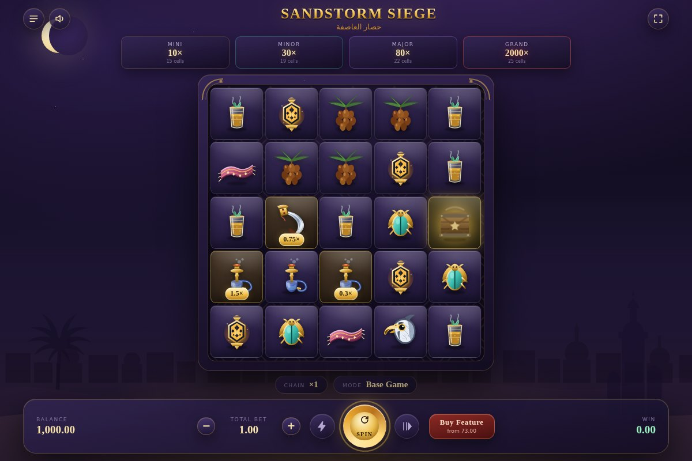
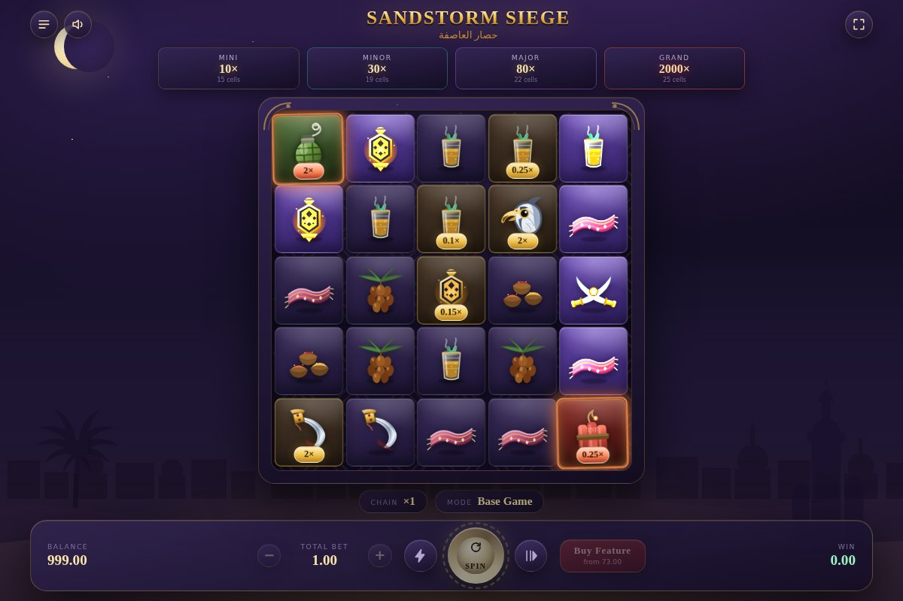
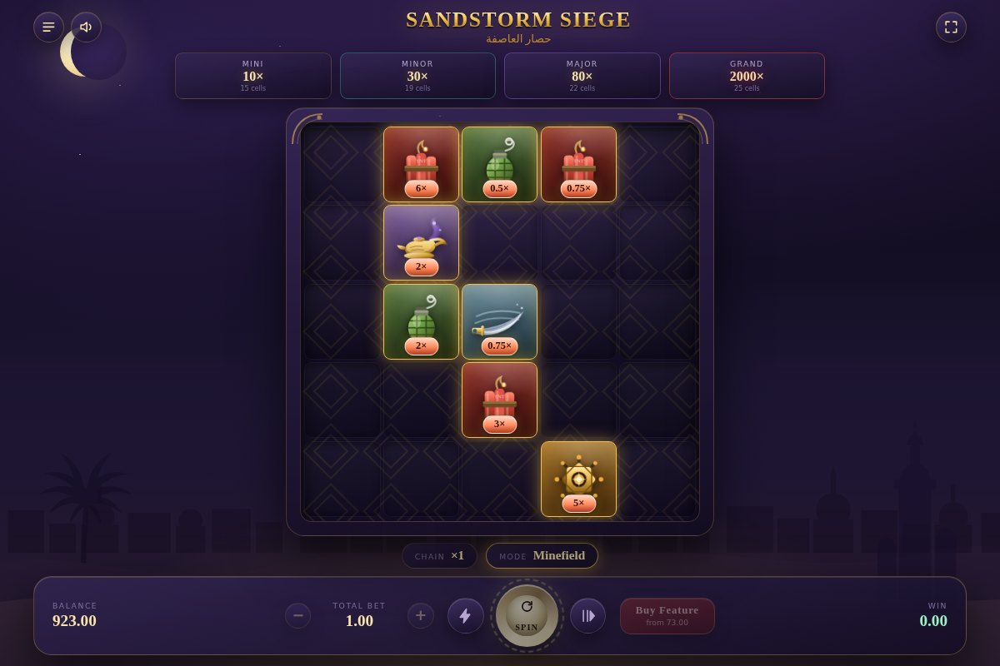

# Sandstorm Siege · حصار العاصفة

A Middle-East themed slot where **bombs, not paylines, pay out**.

There are no paylines and no matching clusters. Tiles land face up, and some of
them carry a printed coin value. That value is banked only when a bomb blows
the tile up — so the whole game is about what lands inside a blast radius.



---

## The mechanic

**1 · Bombs are the payout engine.** Five bomb types land on the 5×5 board,
each with its own blast footprint. Every bomb on the board detonates at the
same time and banks the coin value of everything inside its shape.

| Bomb | Blast | Banks |
| --- | --- | --- |
| Hand Grenade · قنبلة | cross | its own value + the 4 orthogonal tiles |
| Dynamite Bundle · ديناميت | full column | its own value + the other 4 in the column |
| Scimitar Sweep · مقص | full row | its own value + the other 4 in the row |
| Djinn Lamp · مصباح | 3×3 burst | its own value + the 8 around it |
| Star Mine · نجمة | both diagonals | its own value + everything on both diagonals |



*Two bombs armed: the grenade's cross and the dynamite's column light up the
tiles they are about to bank.*

**2 · Chains raise the multiplier.** Survivors fall into the crater and fresh
tiles drop in. If that refill lands another bomb, the chain continues one rung
higher: **×1 → ×2 → ×3 → ×5 → ×8 → ×12 → ×20 → ×35 → ×60**.

**3 · Loot tiles.** About one tile in six lands carrying a coin value, from
`0.1×` on dates up to `8×` on the crossed sabres. Everything else is scenery a
blast simply sweeps away.

**4 · Sandstorm free spins.** Three or more Sandstorms award 10 free spins
(+5 per extra scatter). Sandstorms are blast-proof, so they survive to trigger.
During the feature the chain multiplier **never resets** — every detonation
raises it for the rest of the round, up to ×20.

**5 · Minefield hold & win.** Four or more Ammo Crates freeze the board. The
crates and any bombs lock in place, then 3 respins try to fill the grid. Every
new bomb resets the respins, and all locked values pay at the end.

| Jackpot | Filled cells | Pays |
| --- | --- | --- |
| Mini | 15 | 10× bet |
| Minor | 19 | 30× bet |
| Major | 22 | 80× bet |
| Grand | 25 | 2,000× bet |



---

## Maths

Measured over 3,000,000 simulated spins (`npm run sim -- 3000000 31337`):

| | |
| --- | --- |
| RTP | **96.92%** — base chains 51.2%, Minefield 14.5%, free spins 31.2% |
| Hit rate | 30.2% |
| Volatility | high — 84.8% of spins return under 1× the stake |
| Free spins | 1 in 248 spins, averaging 77.5× |
| Minefield | 1 in 522 spins, averaging 75.9× |
| Grand jackpot | 1 in ~115,000 spins |
| Max win seen | 2,106× the stake |

Both buy-feature prices are derived from what the features actually pay rather
than guessed, so buying returns the same RTP as ordinary play: Free Spins at
73× (97.2% RTP) and Minefield at 76× (96.8% RTP).

> This is a demo built for play money. Nothing here handles real currency.

---

## Running it

```bash
npm install
npm run dev        # http://localhost:5173
```

| Script | What it does |
| --- | --- |
| `npm run dev` | dev server with hot reload |
| `npm run build` | typecheck, then a production bundle in `dist/` |
| `npm run preview` | serve the production bundle |
| `npm test` | engine test suite (node:test) |
| `npm run sim -- [spins] [seed]` | Monte-Carlo RTP and volatility probe |
| `npm run typecheck` | `tsc --noEmit` |

Append `?seed=12345` to the URL to make a session reproducible — handy for
demos and bug reports.

### Controls

Space or Enter spins. The bottom bar carries the stake stepper, turbo,
autoplay, buy-feature and the win readout; the top bar has the paytable, sound
and fullscreen.

---

## How it is put together

No runtime dependencies. The build is Vite + TypeScript and the whole game
ships as one bundle — the artwork is inline SVG and every sound effect is
synthesised with the Web Audio API, so there are no image or audio assets.

```
src/
  game/         pure logic, no DOM
    config.ts     symbols, bombs, blast footprints, paytable, feature rules
    engine.ts     spin resolution: detonation waves, gravity, features
    rng.ts        seedable mulberry32
    types.ts
  art/
    symbols.ts    the SVG sprite sheet (12 symbols, 5 bombs)
  render/
    board.ts      tile DOM and the animation choreography
    fx.ts         canvas particles, sparks, smoke, confetti
    sound.ts      synthesised sound cues
    ui.ts         control bar, meters, modals, banners
  styles/         design tokens, board, UI, banners
  main.ts         the controller that drives engine output through the renderer
tools/
  sim.ts          Monte-Carlo RTP probe
  engine.test.ts  engine invariants
```

`src/game` never touches the DOM: `engine.spin()` returns a fully resolved
`SpinResult` describing every wave, and the renderer replays it. That split is
what makes the RTP probe and the test suite possible.
