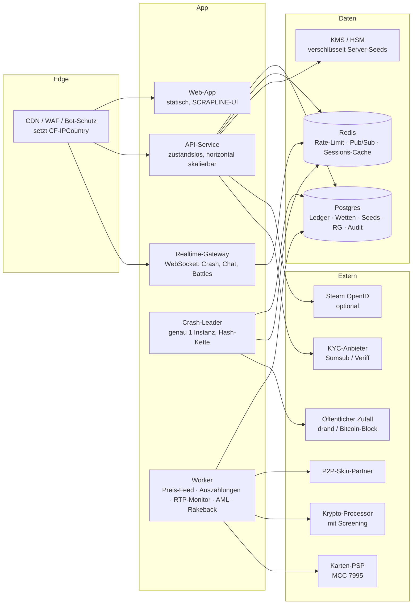
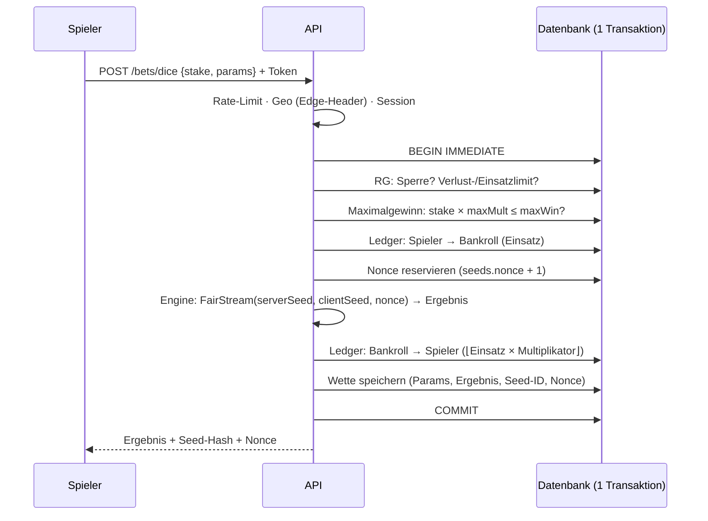

# Phase 4 – Architektur & Backend-Fundament (SCRAPLINE)

Stand: 28.09.2026 · Code: [`platform/server`](../../platform/server) (Demo-Backend, lauffähig) · baut auf der Engine aus Phase 3 auf.

Diese Phase liefert:
1. die **Zielarchitektur** für Demo- und späteren Echtgeld-Betrieb,
2. ein **lauffähiges Demo-Backend**: Wallet mit doppelter Buchführung, Wett-Service für 6 Spiele,
   Seed-Verwaltung, Responsible Gambling, Geo-Blocking, Steam-Login, KYC- und AML-Prüfungen, HTTP-API,
3. **44 Tests**, darunter das Nachspielen jeder Wette aus dem offengelegten Seed, PvP-, Crash- und Belohnungs-Abläufe und ein End-to-End-Test der API.

---

## 0. Kritisches Risiko zuerst: Steam und Valve

> **Valve verbietet Glücksspiel über seine Schnittstellen.** 2016 erklärte Valve: *„Using the OpenID API and
> making the same web calls as Steam users to run a gambling business is not allowed by our API nor our user
> agreements.“* Danach gingen Abmahnungen an 23 Skin-Gambling-Seiten
> ([Game Informer](https://gameinformer.com/b/news/archive/2016/07/13/valve-to-demand-gambling-sites-using-steam-login-cease-operations.aspx),
> [Dot Esports](https://dotesports.com/counter-strike/news/valve-distance-skin-gambling-3636)).

Folgen für SCRAPLINE:

| Risiko | Wirkung | Gegenmaßnahme in dieser Architektur |
|---|---|---|
| Betreiber-eigene Trade-Bots | Bot-Konten werden gebannt, Items sind weg, Vertragsbruch | **Keine eigenen Bots.** Skins laufen nur über einen **P2P-Marktplatz-Partner**: Items gehen direkt von Spieler zu Spieler, die Plattform hält nur Guthaben (`SkinRail` in `src/rails.ts`). |
| Steam-Login (OpenID) als einziger Login | Valve kann den Zugriff sperren, dann kommt niemand mehr ins Konto | Steam-Login ist **optional**. Konten sind eigenständig (Demo: Name, Produktion: E-Mail oder Passkey), Steam wird nur verknüpft. Die Trennung ist im Demo-Backend schon angelegt. |
| Abhängigkeit vom Skin-Preis-Feed | Falsche Preise führen zu Arbitrage | Mehrere Quellen, Ausreißer-Filter, illiquide Items werden abgelehnt (`PriceFeed`). |
| Rechtsrahmen je Land | Skins gelten vielerorts als Wert, sind also Glücksspiel | Echtgeld nur mit Lizenz und Geo-Liste (Abschnitt 6). |

**Empfehlung:** Das Kerngeschäft sollte ohne Steam lebensfähig sein. Krypto und Karte sind die primären
Zahlungswege, Skins ein zusätzlicher Zahlungsweg über den Partner. Vor jeder Investition in Echtgeld sollte
ein Anwalt für Glücksspielrecht das bestätigen.

Steam-Fakten für den Skin-Weg: Ohne Steam Guard Mobile Authenticator (mindestens 7 Tage aktiv) hält Steam
Trades bis zu 15 Tage zurück. Frisch gekaufte Items können Handelssperren haben. Die Trade Protection
(7 Tage rückgängig machbar) betrifft CS2, nicht Rust (siehe Phase 1). Der Partner muss gesperrte Items ablehnen.

---

## 1. Systemübersicht



| Baustein | Demo (dieses Repo) | Produktion |
|---|---|---|
| Datenbank | `node:sqlite`, WAL, eine Datei | Postgres 16 mit Point-in-Time-Recovery. Gleiches Schema, Sperren über `SELECT … FOR UPDATE` auf `balances` |
| Server-Seeds | Klartext in der DB | per KMS verschlüsselt (Envelope). Nur der API-Prozess darf entschlüsseln |
| Crash | `CrashService`: Hash-Kette (100 000 Runden), Client-Seed aus Beacon-Runde, Live-Events per Server-Sent Events (`GET /crash/stream`) | eigener Leader-Prozess (genau 1 aktiv), Kette mit 10 Mio. Seeds |
| PvP (Münzwurf, Battles) | Lobby mit Escrow-Konto. Client-Seed = Beacon-Runde (aktuell + 2), die erst nach dem Lock feststeht. Demo-Bots als Gegner | ohne Bots, mit Matchmaking und Spam-Schutz |
| Zahlungswege | nur Demo-Faucet | `SkinRail`, `CryptoRail`, `CardRail` (Schnittstellen in `src/rails.ts`) |
| Zufalls-Beacon | `LocalBeacon`: vorab festgelegte Hash-Kette, **nicht vertrauenslos** (die API kennzeichnet das). drand ist aus der Entwicklungsumgebung nicht erreichbar | `DrandBeacon` (drand quicknet, alle 3 s, BLS-signiert), per `BEACON=drand` aktivierbar |

---

## 2. Ablauf einer Wette



Schlägt ein Schritt fehl, rollt die ganze Transaktion zurück. Dann gibt es keine Buchung, keine verbrauchte
Nonce und keine Wette. Der Test „rolls back the whole bet“ prüft genau das.

**Minenfeld und Raid** haben Zustand. Beim Start werden Einsatz und Nonce festgelegt, damit steht das Ergebnis fest.
Jeder weitere Zug spielt denselben `FairStream` erneut ab. Solange eine Runde offen ist, kann der Seed nicht
rotiert werden. Die Minenpositionen verlassen den Server erst nach der Abrechnung (per Test abgesichert).

**Maximalgewinn:** Eine Wette, deren bestmögliche Auszahlung die Grenze überschreitet, wird abgelehnt, und die API
nennt den höchsten erlaubten Einsatz. Bei Minenfeld und Raid wird stattdessen der **nächste Schritt** abgelehnt,
Auszahlen geht weiter. So bleibt der RTP exakt, eine abgeschnittene Auszahlung würde ihn verzerren.
Damit ist Punkt 4 aus Phase 3 umgesetzt.

---

## 3. Geld und Ledger

- **Einheit:** Milli-Frags als Ganzzahl (1 Frag = 1 000 mF = 0,01 $). Auszahlungen werden abgerundet.
  Die Rundung kostet höchstens 0,001 Frag pro Wette (Punkt 5 aus Phase 3).
- **Doppelte Buchführung:** Jede Buchung schreibt zwei Zeilen, deren Summe null ist. Konten: `user:<id>`,
  `house:bankroll`, `house:demo-faucet`. Spielerkonten können nie ins Minus gehen.
- **Invariante:** `Σ ledger = 0`, und jeder zwischengespeicherte Saldo entspricht der Ledger-Summe (`ledgerIntegrity()`).
  Die Tests prüfen das nach jedem Szenario. In der Produktion prüft ein Job es stündlich und alarmiert bei Abweichung.
- **Ledger-Arten:** `stake`, `payout`, `refund`, `demo_grant`, `deposit`, `withdrawal`, `rakeback`.

---

## 4. Provably Fair im Betrieb

| Aktion | Endpunkt | Verhalten |
|---|---|---|
| Aktiven Seed ansehen | `GET /seed` | Hash, Client-Seed, nächste Nonce |
| Rotieren (+ neuer Client-Seed) | `POST /seed/rotate` | legt den alten Server-Seed offen. Abgelehnt, solange eine Runde offen ist |
| Wette prüfen | `GET /bets/:id` | öffentlich: Parameter, Ergebnis, Hash, Client-Seed, Nonce und nach der Rotation der Server-Seed |
| Live-RTP | `GET /stats/rtp?days=30` | tatsächlicher RTP je Spiel (Grundlage für das Fair-Ledger aus Phase 2) |

Ein Test spielt 40 gemischte Wetten, rotiert und rechnet jede Wette mit der Engine aus dem offengelegten Seed nach.
Alle Auszahlungen stimmen auf die Milli-Frag. Die öffentliche Prüfer-Seite aus Phase 3 nutzt dieselbe Rechnung.

---

## 5. Responsible Gambling (umgesetzt)

| Werkzeug | Regel | Endpunkt |
|---|---|---|
| Limits | Einzahlung, Verlust und Einsatz je Tag, Woche oder Monat (rollierend). Senken und Neusetzen wirken sofort, **Erhöhen und Entfernen erst nach 24 h** | `GET /rg`, `PUT /rg/limits` |
| Verlustrechnung | Offene Runden zählen als verloren, bis sie abgerechnet sind (konservativ) | – |
| Pause | 24 h bis 6 Wochen, nicht verkürzbar | `POST /rg/cooldown` |
| Selbstausschluss | 6, 12 oder 60 Monate oder dauerhaft, beendet sofort alle Sessions | `POST /rg/exclusion` |
| Reality-Check | 15, 30, 60 oder 120 min. `GET /me` liefert Spielzeit, Einsatz, Netto und den nächsten Check-Zeitpunkt | `PUT /rg/reality-check` |
| Promo-Sperre | Während Pause oder Ausschluss: kein Rain, kein Rakeback-Hinweis, keine Mails (`promoEligible`) | – |
| Kein Kredit | Es gibt keine Funktion, die Guthaben leiht. Spielerkonten können nicht ins Minus | – |

Alle Änderungen landen im `audit`-Log mit Zeitstempel. Für die Lizenz ist das Pflicht.

---

## 6. Compliance-Hooks

**Alter und KYC**

| Stufe | Voraussetzung | Wofür |
|---|---|---|
| 0 | 18+ selbst bestätigt (ohne Bestätigung keine Registrierung, im Audit protokolliert) | nur Demo |
| 1 | Ausweis, Liveness-Check, Adresse über `KycProvider` | vor der ersten Echtgeld-Einzahlung |
| 2 | Herkunft der Mittel | ab 2 000 $ kumulierten Einzahlungen |

**AML:** `withdrawalCheck()` nennt dem Spieler jeden fehlenden Punkt im Klartext: KYC-Stufe, einmal Umsatz der
Einzahlungen seit der letzten Auszahlung und keine Auszahlung im Demo-Modus. `flagDeposit()` markiert große und
gestückelte Einzahlungen zur manuellen Prüfung. Es sperrt nie stillschweigend.

**Geo:** Das Land kommt nur aus dem Header der Edge (`CF-IPCountry`). Sanktionsländer sind immer gesperrt (HTTP 451).
Die Länder aus der Lizenzliste sind nur für Echtgeld gesperrt, der Demo-Modus bleibt dort nutzbar. Ein unbekanntes Land
(`XX`, Tor `T1`, kein Header) wird für Echtgeld gesperrt. In der Produktion kommen VPN-Erkennung hinzu und die
KYC-Adresse, die nach der Verifizierung Vorrang vor der IP hat. Die Länderliste im Code ist ein **Startwert** und muss mit der Lizenz abgeglichen werden.

**Steam-Login:** `verifyAssertion()` prüft Endpunkt, `return_to`, Form der `claimed_id` (SteamID64), Alter der Nonce
(höchstens 5 min) und Wiederverwendung der Nonce. Danach bestätigt Steam per `check_authentication` die Signatur.
Der gültige Fall und fünf Angriffsfälle sind getestet.

---

## 7. API (Demo)

| Methode | Pfad | Zweck |
|---|---|---|
| GET | `/health`, `/config`, `/stats/rtp`, `/bets/:id` | öffentlich: Konfiguration inkl. Plinko-Tabellen, Kisteninhalt mit Chancen, RTP |
| POST | `/auth/demo` | Demo-Konto (18+ Pflicht), liefert Token |
| GET | `/auth/steam`, `/auth/steam/return` | Steam-OpenID |
| GET | `/me` | Konto, Guthaben, Seed, Session-Zusammenfassung, Sperren |
| POST | `/demo/refill` | Demo-Nachschub, einmal pro 24 h |
| POST | `/bets/dice` · `/bets/plinko` · `/bets/upgrader` · `/bets/cases` | Sofortspiele |
| POST | `/mines/start` · `/mines/:id/reveal` · `/mines/:id/cashout` | Minenfeld |
| POST | `/raid/start` · `/raid/:id/blast` · `/raid/:id/cashout` | Raid |
| GET/POST | `/seed`, `/seed/rotate` | Provably Fair |
| GET/PUT/POST | `/rg`, `/rg/limits`, `/rg/cooldown`, `/rg/exclusion`, `/rg/reality-check` | Responsible Gambling |
| GET | `/wallet/withdrawal-check?amount=` | Voraussetzungen für Auszahlungen |
| GET/POST | `/crash/state`, `/crash/bet`, `/crash/cashout`, `/crash/stream` (SSE) | Schrottpresse |
| GET/POST | `/pvp/list/:type`, `/pvp/game/:id`, `/pvp/coinflip`, `/pvp/battle`, `/pvp/:id/join`, `/pvp/:id/bot`, `/pvp/:id/cancel` | Münzwurf und Kisten-Battle |
| GET | `/games/open` | offene Minenfeld- und Raid-Runden (nach einem Neuladen) |
| GET/POST | `/rewards`, `/rewards/rakeback`, `/rewards/daily`, `/rewards/rain`, `/crew/code`, `/crew/redeem`, `/crew/claim` | Level, Rakeback, Schrottkiste, Ölregen, Crew |

Einsätze gibt die API in Frags an, gespeichert werden Milli-Frags. Fehler haben immer die Form
`{ error, message, details }` mit deutscher Meldung. Jede Anfrage durchläuft Rate-Limit (20/s, Burst 40 je IP),
Größenlimit (16 KB) und Geo-Prüfung.

```bash
cd platform/server && npm install
npm test     # 44 Tests
npm start    # http://localhost:8787, Datei data/scrapline-demo.sqlite
```

---

## 8. Sicherheit

- Session-Tokens: 32 Zufallsbytes, gespeichert wird nur der SHA-256. Ablauf nach 7 Tagen, Selbstausschluss löscht alle Sessions.
- Keine Geheimnisse im Client. Steam-Web-API-Key, KYC- und PSP-Schlüssel nur in einem Secret-Store.
- Server-Seeds werden nie ausgegeben, solange sie aktiv sind (per Test abgesichert). In der Produktion sind sie per KMS verschlüsselt.
- Jede Geldbewegung läuft in einer Transaktion. Doppeltes Absenden verhindern in der Produktion Idempotenz-Keys (`Idempotency-Key`-Header).
- Admin-Zugriffe nur mit Hardware-Key (WebAuthn), jede Admin-Aktion im Audit-Log. Das Audit-Log wird nur ergänzt, nie geändert (WORM-Speicher).
- Abhängigkeiten: Das Backend hat **keine** Laufzeit-Abhängigkeiten außer Node selbst. Das hält die Angriffsfläche klein.

---

## 9. Betrieb und Deployment (Produktion)

| Thema | Vorgabe |
|---|---|
| Umgebungen | dev → staging (Spielgeld, echte Anbieter im Sandbox-Modus) → prod |
| CI | Typprüfung, Engine-Tests (57), Server-Tests (44, SQLite und Postgres), Monte-Carlo-Kurzlauf (1 Mio. Runden) bei jedem Merge, voller Lauf (10 Mio.) nächtlich |
| Deployment | Container. API und Worker mit mehreren Replikas. Crash-Leader mit Leader-Election (genau 1 aktiv) |
| Daten | Postgres mit Replika und Point-in-Time-Recovery. Tägliches Backup mit Test-Wiederherstellung |
| Monitoring | Traces, Metriken und Logs. **RTP-Monitor** je Spiel: Alarm, wenn der rollierende RTP mehr als 4 Standardfehler von der Theorie abweicht. Ledger-Integrität stündlich |
| Incident | Kill-Switch je Spiel (Wetten aus, Auszahlen geht weiter), Statusseite |

---

## 10. Nächste Schritte

| Phase | Inhalt |
|---|---|
| 5 | ✔ **Frontend** im SCRAPLINE-Design (`platform/web`): Lobby, alle Spiele, RG-Center, Provably Fair, Verlauf |
| 6 | ✔ PvP-Lobby (Münzwurf, Battles) mit Beacon-Zufall, Crash-Service mit Hash-Kette und SSE, alles im Frontend |
| 7 | ✔ Retention: Level/XP auf erwarteten Verlust, Rakeback 5–30 %, Schrottkiste (täglich, nachprüfbar), Ölregen, Crew-Codes mit NGR-Anteil. Während Pausen keine Promo-Guthaben |
| 8 | ✔ Echtgeld-Vorbereitung dokumentiert ([05-go-live.md](05-go-live.md)): Lizenz, Rechtsgutachten (Steam!), KYC-Anbieter, Zahlungswege, externes RNG-Audit |
| 9 | ✔ Backoffice (KPIs, RTP-Monitor mit z-Wert, Spieler, Holds, Kill-Switch, RG-Fälle, Audit) und Live-Chat mit Moderation ([06-backoffice-und-chat.md](06-backoffice-und-chat.md)) |
